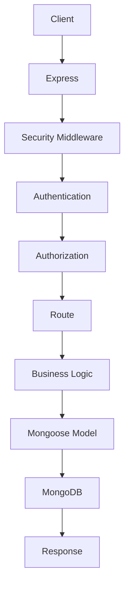
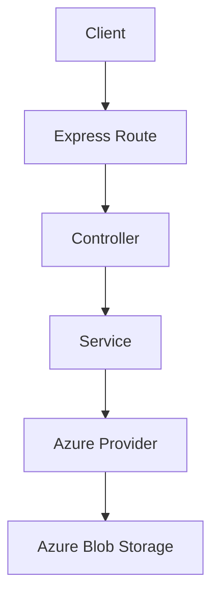

# Team 4 Architecture Report

## 1. Objective
Team 4 was created to own the External Services boundary for the IEEE ERP system without taking over Team T2's core backend ownership. The goal was to extend the existing backend architecture in a way that keeps the platform cohesive, reduces duplicated infrastructure, and preserves clear team boundaries.

Team 4's responsibility is to add service-oriented capabilities such as storage, email, PDF generation, AI integration, and backup orchestration. These capabilities support the broader ERP platform but do not replace or fragment Team T2's backend. Instead, they plug into the same Express backend so the system behaves as one application while maintaining separate ownership of concerns.

## 2. Reference Documents
The architecture was designed using the following primary references:

- [agent.md](agent.md)
- [T2_Backend_Architecture.md](T2_Backend_Architecture.md)

These documents were treated as the source of truth for backend layering, integration boundaries, security expectations, and project structure. Team 4 followed those constraints while adding only external-service modules.

## 3. Analysis of Team 2 Architecture
Team T2 defines the main backend architecture for IEEE ERP. The backend is organized as a layered Express application with a controlled flow from the HTTP edge down to MongoDB.

### Layered Architecture
Team T2 uses a layered design:

- Entry layer for server bootstrapping and middleware registration.
- Configuration layer for database and environment setup.
- Middleware layer for authentication, authorization, error handling, and rate limiting.
- API layer for route definitions and request handling.
- Data layer for Mongoose models and persistence.

This structure keeps routing, middleware, and persistence responsibilities separated so the backend remains maintainable and easier to evolve.

### Routing
Team T2 centralizes REST API routing under the backend source tree and expects route modules to be mounted through the Express server. Routes are the public contract surface for clients and are responsible for connecting HTTP requests to controller logic.

### Middleware
Team T2's architecture places middleware at the front of the request pipeline. This includes security, authentication, authorization, validation, and rate limiting. The intent is to reject invalid or unauthorized requests before they reach business logic.

### Models
Team T2 uses Mongoose models as the persistence layer. Models represent the core ERP entities and act as the data access boundary between the API and MongoDB.

### Configuration
Team T2 separates configuration concerns into dedicated modules. Environment variables, database connection logic, and runtime settings are not scattered through route handlers or services.

### Request Flow
The request flow defined by Team T2 is intentionally layered:



This flow is important because Team 4's modules had to fit into the same operational pattern instead of introducing a parallel backend style.

## 4. Team 4 Integration Strategy
Team 4 does not create a separate backend because the IEEE ERP system is already defined around a single Express backend owned by Team T2. Creating another backend would split routing, authentication, deployment, and data boundaries across multiple services without a business need for full service decomposition.

Team 4 extends Team T2's backend instead of replacing it. This approach keeps the application unified while adding only the external-service domain modules needed for storage, email, PDF, AI, and backup support.

This strategy minimizes merge conflicts in three ways:

- It avoids duplicating server bootstrap, middleware, and route mounting logic.
- It keeps Team 4 changes isolated to new folders and files rather than touching Team T2-owned modules.
- It creates a stable extension surface that Team T2 can integrate later with minimal friction.

## 5. Folder Structure Created
The following backend structure was created for Team 4.

```text
backend/src/
├── config/
│   ├── azure.js
│   ├── email.js
│   └── gemini.js
├── controllers/
│   ├── aiController.js
│   ├── emailController.js
│   ├── pdfController.js
│   └── storageController.js
├── middleware/
│   └── upload.js
├── models/
│   └── File.js
├── routes/
│   ├── ai.js
│   ├── email.js
│   ├── pdf.js
│   └── storage.js
└── services/
    ├── ai/
    │   └── GeminiService.js
    ├── backup/
    │   └── BackupService.js
    ├── email/
    │   └── EmailService.js
    ├── pdf/
    │   └── PdfService.js
    └── storage/
        ├── AzureBlobProvider.js
        ├── StorageService.js
        └── index.js
```

### config/
#### azure.js
Purpose: Stores Azure Blob Storage configuration values in one place so storage infrastructure can be changed without editing controllers or services.

#### email.js
Purpose: Stores email delivery configuration and provider settings in one isolated module.

#### gemini.js
Purpose: Stores Gemini AI configuration and model settings in one isolated module.

### controllers/
#### storageController.js
Purpose: Receives storage-related requests and delegates processing to the storage service.

#### emailController.js
Purpose: Receives email-related requests and delegates processing to the email service.

#### pdfController.js
Purpose: Receives PDF-related requests and delegates processing to the PDF service.

#### aiController.js
Purpose: Receives AI-related requests and delegates processing to the Gemini service.

### middleware/
#### upload.js
Purpose: Provides a dedicated middleware boundary for upload handling, validation, and future file constraints.

### models/
#### File.js
Purpose: Defines the persistence model boundary for uploaded file metadata.

### routes/
#### storage.js
Purpose: Defines the route boundary for storage operations once Team 2 mounts Team 4 routes.

#### email.js
Purpose: Defines the route boundary for email operations once Team 2 mounts Team 4 routes.

#### pdf.js
Purpose: Defines the route boundary for PDF operations once Team 2 mounts Team 4 routes.

#### ai.js
Purpose: Defines the route boundary for AI operations once Team 2 mounts Team 4 routes.

### services/
#### storage/AzureBlobProvider.js
Purpose: Handles Azure Blob SDK interaction in one isolated provider layer.

#### storage/StorageService.js
Purpose: Provides storage business logic independent of Azure so the provider can be replaced later.

#### storage/index.js
Purpose: Exposes the storage service boundary and keeps provider/service wiring centralized.

#### email/EmailService.js
Purpose: Owns email business logic and future transport orchestration.

#### pdf/PdfService.js
Purpose: Owns PDF generation and preview business logic.

#### ai/GeminiService.js
Purpose: Owns Gemini AI orchestration and keeps model-specific integration isolated.

#### backup/BackupService.js
Purpose: Owns backup orchestration logic for Team 4-managed integrations.

## 6. Design Decisions

### Controllers are thin
Controllers were intentionally kept thin so they only receive requests and forward them to services. This prevents HTTP concerns from leaking into the business layer and keeps controller code easy to read and test.

### Services contain business logic
All business logic belongs in services because the service layer is the right place for use-case orchestration, provider selection, and future validation workflows. This follows single-responsibility principles and keeps controllers from becoming large and brittle.

### Azure SDK code is isolated
Azure-specific SDK access is isolated inside AzureBlobProvider so the rest of the application does not depend directly on Azure APIs. This protects the architecture from vendor lock-in and makes future provider replacement straightforward.

### Upload middleware is separate
Upload concerns were separated into their own middleware file because file validation and request preprocessing belong in the request pipeline, not inside controllers or services. This also makes file handling easier to harden later.

### Configuration files are isolated
Each integration has its own configuration module so environment and runtime settings are not spread through the codebase. This reduces coupling and makes operational changes safer.

### Environment variables are centralized
Centralizing environment variables in config modules makes the integration points explicit and reduces the chance of hidden runtime dependencies. It also supports clearer deployment management and simpler local setup.

## 7. Integration with Team 2
Team T2 will interact with Team 4 through the same Express backend by mounting the new route modules when the integration phase begins. Team 4 does not change Team 2's backend design; it adds service-oriented extensions that Team T2 can call in the same request lifecycle.

The complete request flow is:



This flow preserves the boundary between HTTP handling, business logic, and infrastructure access.

## 8. Future Modules
Team 4's architecture was designed so each future module follows the same pattern.

### Storage
Storage uses a provider abstraction:

- Controller accepts request.
- Service coordinates storage behavior.
- Provider handles Azure Blob SDK interaction.

This pattern keeps storage portable and future-proof.

### Email
Email follows the same controller-service separation so future mail providers can be swapped without changing routes.

### PDF
PDF generation is isolated into its own service because PDF creation is a business capability that may later depend on external libraries or rendering engines.

### Gemini AI
Gemini AI is separated into a dedicated service and config module so model-specific behavior stays contained.

### Backup
Backup is modeled as a separate service because backup workflows often become cross-cutting operations that should not be embedded in controllers or storage handlers.

All of these modules follow the same design so the backend stays predictable, testable, and easy to extend.

## 9. Advantages of this Architecture

### Maintainability
The code is organized by responsibility, which makes future changes easier to localize.

### Scalability
New integration providers and service capabilities can be added without restructuring the backend.

### Separation of Concerns
HTTP handling, business logic, configuration, and infrastructure access are kept in separate layers.

### SOLID Principles
The design supports single responsibility, dependency inversion, and open-closed behavior through provider abstraction and service boundaries.

### Ease of Testing
Thin controllers and isolated services are easier to unit test and mock.

### Provider Pattern
The storage design supports a provider pattern so Azure can be replaced with another storage backend later.

### Future Cloud Migration
Because Azure code is isolated, migration to a different provider or hybrid storage strategy can be done with minimal changes to the application core.

## 10. Future Integration Plan
Once Team T2's integration branch is available, Team 4 can be merged into the backend through a controlled process:

1. Add the Team 4 modules to the Team T2 backend tree.
2. Mount the new route files in the existing Express server entrypoint.
3. Connect controllers to the services already scaffolded by Team 4.
4. Confirm that no Team T2-owned files were structurally altered beyond route registration.
5. Validate that the backend still follows the single Express application pattern described in Team T2's architecture.

This process is expected to be low-risk because Team 4 already matches the same layered structure and only adds new modules rather than rewriting core backend behavior.

## 11. Summary
Team 4 created a dedicated external-services architecture inside the existing IEEE ERP backend instead of building a separate backend. The result is a clean extension layer for storage, email, PDF, AI, and backup capabilities that respects Team T2's ownership and the overall backend design.

The phase completed the following work:

- Added isolated configuration modules for Azure, Gemini, and email.
- Added upload middleware as a distinct request-processing layer.
- Added a File model for uploaded file metadata.
- Added thin controllers for storage, email, PDF, and AI flows.
- Added route modules for future integration without mounting them yet.
- Added a provider-based storage service architecture centered on AzureBlobProvider.
- Added service modules for storage, email, PDF, AI, and backup.

### Files created and edited during this phase
- [backend/src/config/azure.js](backend/src/config/azure.js)
- [backend/src/config/email.js](backend/src/config/email.js)
- [backend/src/config/gemini.js](backend/src/config/gemini.js)
- [backend/src/controllers/aiController.js](backend/src/controllers/aiController.js)
- [backend/src/controllers/emailController.js](backend/src/controllers/emailController.js)
- [backend/src/controllers/pdfController.js](backend/src/controllers/pdfController.js)
- [backend/src/controllers/storageController.js](backend/src/controllers/storageController.js)
- [backend/src/middleware/upload.js](backend/src/middleware/upload.js)
- [backend/src/models/File.js](backend/src/models/File.js)
- [backend/src/routes/ai.js](backend/src/routes/ai.js)
- [backend/src/routes/email.js](backend/src/routes/email.js)
- [backend/src/routes/pdf.js](backend/src/routes/pdf.js)
- [backend/src/routes/storage.js](backend/src/routes/storage.js)
- [backend/src/services/ai/GeminiService.js](backend/src/services/ai/GeminiService.js)
- [backend/src/services/backup/BackupService.js](backend/src/services/backup/BackupService.js)
- [backend/src/services/email/EmailService.js](backend/src/services/email/EmailService.js)
- [backend/src/services/pdf/PdfService.js](backend/src/services/pdf/PdfService.js)
- [backend/src/services/storage/AzureBlobProvider.js](backend/src/services/storage/AzureBlobProvider.js)
- [backend/src/services/storage/StorageService.js](backend/src/services/storage/StorageService.js)
- [backend/src/services/storage/index.js](backend/src/services/storage/index.js)

The architecture is now ready for Team 2 integration without changing Team 2's backend structure or ownership boundaries.
